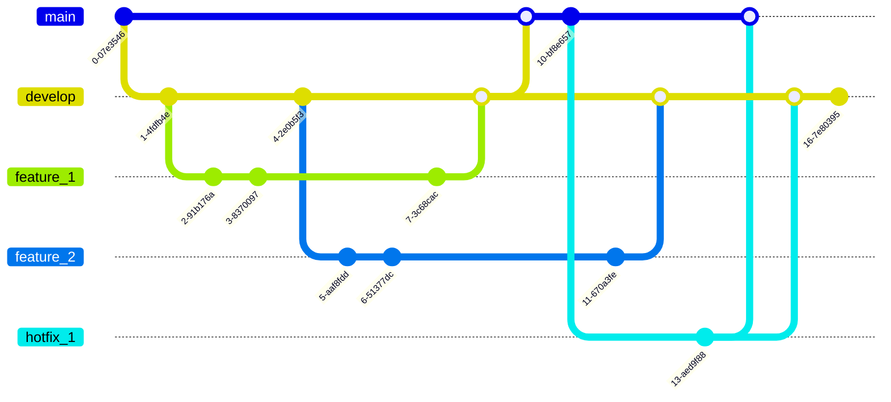

Flujo de trabajo en el repositorio GIT
======================================

Se utilizarán dos ramas para registrar el historial del proyecto. La rama 
principal (master) almacenará el historial de cambios productivos y la rama de 
desarrollo (develop) se utilizará como rama de integración de funciones, quedando 
el flujo de trabajo tal como se enumara a continuación:

1. Se crea una rama de desarrollo (develop) desde la rama principal (master).
2. Las ramas de funciones (feature_1, feature_2, etc) se crean a partir de la 
rama desarrollo (develop).
4. Cuando una función está completa (por ejemplo feature_1), se fusiona con la 
rama de desarrollo (develop).
5. Una vez que las funcionalidades son evaluadas correctamente se fusiona la rama 
desarrollo (develop) con la rama principal (master) mediante [una solicitud de 
fusion](../../merge_requests).
6. Si se detecta un problema en la rama principal (master) que debe ser corregido 
con urgencia, se crea una rama de revisión (hotfix) desde esta.
7. Una vez que se completa la revisión (hotfix), se fusiona tanto en la rama 
desarrollo (develop) como con en la rama principal (master).




## Trabajando con git-flow

Se recomienda la utilización de la biblioteca de extensión git-flow, la cual 
facilitará la tarea de creación de ramas.


### Configuración inicial del repositorio

Una vez clonado el repositorio es posible crear la rama de desarrollo (develop) 
mediante la biblioteca de extensión git-flow de la siguiente manera:


```
$ git flow init


Initialized empty Git repository in ~/project/.git/
No branches exist yet. Base branches must be created now.
Branch name for production releases: [main]
Branch name for "next release" development: [develop]


How to name your supporting branch prefixes?
Feature branches? [feature/]
Release branches? [release/]
Hotfix branches? [hotfix/]
Support branches? [support/]
Version tag prefix? []


$ git branch
* develop
 main
 ```

### Trabajando con una rama de funciones (features)

Para crear una rama llamada feature_1 utilizando la biblioteca de extensión git-flow:

```
git flow feature start feature_1
```

En la cual puede continuar su trabajo utilizando Git normalmente hasta desarrollar 
la nueva característica. Una vez finalizado el trabajo con esta característica será 
necesario fusionar en la rama de desarrolo (develop) de la siguiente manera:

```
git flow feature finish feature_1
```


### Trabajando con una rama de revisión (hotfix)

Para crear una rama llamada hotfix_1 utilizando la biblioteca de extensión git-flow:

```
git flow hotfix start hotfix_1
```

En la cual puede continuar su trabajo utilizando Git normalmente hasta desarrollar 
la revisión. Una vez finalizado el trabajo será necesario fusionar en la ramas 
desarrollo (develop) y la rama principal (master) de la siguiente manera:

```
git flow hotfix finish hotfix_1
```


Información del autor
---------------------

[Martin Andres Gomez Gimenez](https://gitlab.nis.com.ar/mggimenez)
